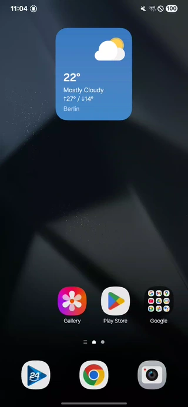

# SplashScreenDecorator 🎨

[](https://central.sonatype.com/artifact/net.kibotu/SplashScreenDecorator)
[](https://jitpack.io/#kibotu/SplashScreenDecorator)
[](https://github.com/kibotu/SplashScreenDecorator/actions/workflows/android.yml)
[](https://android-arsenal.com/api?level=21)
[](https://android-arsenal.com/api?level=36)
[](https://www.oracle.com/java/technologies/javase/17all-relnotes.html)
[](https://docs.gradle.org/current/release-notes)
[](https://kotlinlang.org/)
[](LICENSE)

> Transform static splash screens into stunning Compose animations with zero setup complexity.

🚀 **About**
SplashScreenDecorator seamlessly bridges the gap between AndroidX SplashScreen and Jetpack Compose. It injects custom Composables into the native splash flow, enabling beautiful animated branding during app startup without the static image limitations of the standard implementation.



## Table of Contents 📑
- [Why SplashScreenDecorator?](#why-splashscreendecorator-)
- [Key Features](#key-features-)
- [Installation](#installation-)
- [Quick Start](#quick-start-)
- [Advanced Usage](#advanced-usage-)
- [Best Practices](#best-practices-)
- [Comparison with Alternatives](#comparison-with-alternatives-)
- [Contributing](#contributing-)
- [License](#license-)

## Why SplashScreenDecorator? 🤔

Modern Android apps demand compelling first impressions, but AndroidX SplashScreen falls short:

### Common Problems
- ❌ Limited to static vector drawables
- ❌ No support for complex animations
- ❌ Jarring transitions between system and app content
- ❌ Difficult to create brand-consistent experiences
- ❌ Poor control over timing and sequencing
- ❌ No Compose integration

### SplashScreenDecorator's Solutions
- ✅ Full Jetpack Compose support with rich animations
- ✅ Seamless transition control with precise timing
- ✅ Custom animation triggers and state management
- ✅ Professional fade orchestration between system and custom views
- ✅ DSL-based configuration for clean, readable code
- ✅ Complete compatibility with AndroidX SplashScreen

## Key Features 🌟

- **Native Compose Integration**: Full Jetpack Compose support for rich, animated splash screens
- **Seamless Transitions**: Smooth orchestration between system splash and custom content
- **Animation Control**: Precise timing control with custom exit animations
- **DSL Configuration**: Clean, type-safe configuration with Kotlin DSL
- **Professional Fade Management**: Staggered fade timing prevents visual jumps
- **State Management**: Reactive state updates for animation triggers
- **Zero Boilerplate**: Simple one-line setup with powerful customization
- **AndroidX Compatible**: Built on top of AndroidX SplashScreen for maximum compatibility

## Installation 📦

### Maven Central

```groovy
allprojects {
    repositories {
        mavenCentral()
    }
}

dependencies {
    implementation 'net.kibotu:SplashScreenDecorator:{latest-version}'
}
```

### JitPack (Alternative)

1. Add JitPack repository:
```groovy
// settings.gradle.kts
dependencyResolutionManagement {
    repositories {
        maven { url = uri("https://jitpack.io") }
    }
}
```

2. Add the dependency:
```groovy
// build.gradle.kts
dependencies {
    implementation("com.github.kibotu:SplashScreenDecorator:latest-version")
}
```

## Quick Start 🚀

### 1. Basic Setup

Create an animated splash screen with just a few lines:

```kotlin
class MainActivity : ComponentActivity() {
    
    private var splashScreen: SplashScreenDecorator? = null
    
    override fun onCreate(savedInstanceState: Bundle?) {
        // Initialize splash before super.onCreate()
        splashScreen = splash {
            content {
                // Your custom Compose content
                SplashScreenDecoratorTheme {
                    HeartBeatAnimation(
                        isVisible = isVisible.value,
                        exitAnimationDuration = exitAnimationDuration.milliseconds,
                        onStartExitAnimation = { startExitAnimation() }
                    )
                }
            }
        }
        // start your own splash screen animation
        splashScreen?.shouldKeepOnScreen = false
        
        super.onCreate(savedInstanceState)
        
        setContent {
            MyAppTheme {
                MainScreen()
            }
        }
    }

    override onStart() {
        super.onStart()

        // trigger your custom splash animation
        splashScreen?.dismiss()
    }
}
```


### 3. Advanced Configuration

```kotlin
splashScreen = splash {
    // Customize animation durations
    exitAnimationDuration = 800L
    composeViewFadeDurationOffset = 300L
    
    content {
        MyTheme {
            ComplexSplashAnimation(
                isVisible = isVisible.value,
                exitDuration = 800.milliseconds,
                onStartExitAnimation = { startExitAnimation() }
            )
        }
    }
}
```

## Advanced Usage 🔧

### Heartbeat Animation Pattern

The library includes a sophisticated heartbeat animation as an example:

```kotlin
@Composable
fun HeartBeatAnimation(
    isVisible: Boolean = true,
    exitAnimationDuration: Duration = 600.milliseconds,
    onStartExitAnimation: () -> Unit = {}
) {
    val rippleCount = 4
    val baseSize = 144.dp
    
    var isExitAnimationStarted by remember { mutableStateOf(false) }
    
    LaunchedEffect(isVisible) {
        if (!isVisible && !isExitAnimationStarted) {
            isExitAnimationStarted = true
            onStartExitAnimation()
        }
    }
    
    Box(modifier = Modifier.fillMaxSize()) {
        if (isVisible && !isExitAnimationStarted) {
            // Ripple animations
            repeat(rippleCount) { index ->
                RippleCircle(index = index, baseSize = baseSize)
            }
        }
        
        if (isExitAnimationStarted) {
            ExitAnimation(
                baseSize = baseSize,
                duration = exitAnimationDuration
            )
        }
    }
}
```

### Custom Timing Control

Fine-tune animation timing for perfect transitions:

```kotlin
splashScreen = splash {
    exitAnimationDuration = 600L
    composeViewFadeDurationOffset = 200L 
    
    content {
        TimedSplashSequence(
            isVisible = isVisible.value,
            onComplete = { startExitAnimation() }
        )
    }
}
```

### Memory Management

Properly clean up resources:

```kotlin
override fun onDestroy() {
    splashScreen = null
    super.onDestroy()
}
```

## Best Practices 💡

### 1. Animation Timing

```kotlin
// ✅ Good: Coordinated timing
@Composable
fun CoordinatedSplash(controller: SplashScreenController) {
    val animationDuration = 600.milliseconds
    
    LaunchedEffect(controller.isVisible.value) {
        if (!controller.isVisible.value) {
            delay(animationDuration) // Wait for animation
            controller.startExitAnimation()
        }
    }
    
    // Your animation logic
}

// ❌ Bad: Immediate exit without animation
@Composable
fun ImmediateSplash(controller: SplashScreenController) {
    LaunchedEffect(controller.isVisible.value) {
        if (!controller.isVisible.value) {
            controller.startExitAnimation() // Too fast!
        }
    }
}
```

### 2. State Management

```kotlin
// ✅ Good: Clear state separation
@Composable
fun StatefulSplash(isVisible: Boolean, onExit: () -> Unit) {
    var phase by remember { mutableStateOf(SplashPhase.ENTER) }
    
    LaunchedEffect(isVisible) {
        if (!isVisible) {
            phase = SplashPhase.EXIT
            delay(600) // Animation time
            onExit()
        }
    }
    
    when (phase) {
        SplashPhase.ENTER -> EnterAnimation()
        SplashPhase.EXIT -> ExitAnimation()
    }
}

enum class SplashPhase { ENTER, EXIT }
```

### 3. Performance Optimization

```kotlin
// ✅ Good: Efficient animations
@Composable
fun OptimizedSplash() {
    val infiniteTransition = rememberInfiniteTransition()
    
    // Reuse transition for multiple animations
    val scale by infiniteTransition.animateFloat(
        initialValue = 1f,
        targetValue = 1.2f,
        animationSpec = infiniteRepeatable(
            animation = tween(1000),
            repeatMode = RepeatMode.Reverse
        )
    )
    
    // Efficient graphics layer usage
    Box(
        modifier = Modifier.graphicsLayer {
            scaleX = scale
            scaleY = scale
        }
    )
}
```

## Comparison with Alternatives 🔄

### vs *only* AndroidX SplashScreen

| Feature | SplashScreenDecorator | AndroidX SplashScreen |
|---------|----------------------|----------------------|
| Animation Support | ✅ Full Compose animations | ❌ Static vector only |
| Custom Content | ✅ Any Composable | ❌ Icon + background only |
| Transition Control | ✅ Precise timing control | ❌ Limited control |
| Branding Flexibility | ✅ Complete creative freedom | ❌ Very constrained |
| Implementation Complexity | ✅ Simple DSL setup | ✅ Minimal setup |
| Performance | ✅ Optimized Compose rendering | ✅ Lightweight |
| Backward Compatibility | ✅ Built on AndroidX | ✅ Native support |

### vs Custom Splash Activities

| Feature | SplashScreenDecorator | Custom Splash Activity |
|---------|----------------------|------------------------|
| Android 12+ Compliance | ✅ Fully compliant | ❌ Requires extra work |
| App Launch Performance | ✅ No additional activity | ❌ Extra activity overhead |
| Transition Seamlessness | ✅ Native system integration | ❌ Potential flicker |
| Code Complexity | ✅ Single file setup | ❌ Multiple components |
| Maintenance | ✅ Library handles updates | ❌ Manual Android compliance |

### When to Use What?

**Choose SplashScreenDecorator when you need:**
- Rich, animated splash screens with full creative control
- Seamless integration with existing AndroidX SplashScreen setup
- Professional-grade transition management
- Jetpack Compose-based animations
- Android 12+ compliance with zero additional effort
- Complex animation sequences with precise timing

**Choose AndroidX SplashScreen when:**
- Simple static splash with just logo and background
- Minimal app complexity and startup time
- No custom animation requirements
- Smallest possible library footprint

**Choose Custom Splash Activity when:**
- Pre-Android 12 apps with no compliance requirements
- Complex initialization flows requiring multiple screens
- Non-Compose apps with View-based animations

## Contributing 🤝

We welcome contributions! 

1. Fork the repository
2. Create your feature branch (`git checkout -b feature/amazing-animation`)
3. Commit your changes (`git commit -m 'Add amazing animation feature'`)
4. Push to the branch (`git push origin feature/amazing-animation`)
5. Open a Pull Request

## License 📄

This project is licensed under the Apache 2.0 License - see the [LICENSE](LICENSE) file for details.

## Acknowledgments 🙏

- Built on top of [AndroidX SplashScreen](https://developer.android.com/develop/ui/views/launch/splash-screen)
- Powered by [Jetpack Compose](https://developer.android.com/compose)
- Inspired by modern app branding expectations
- Made with ❤️ by [kibotu](https://github.com/kibotu)
